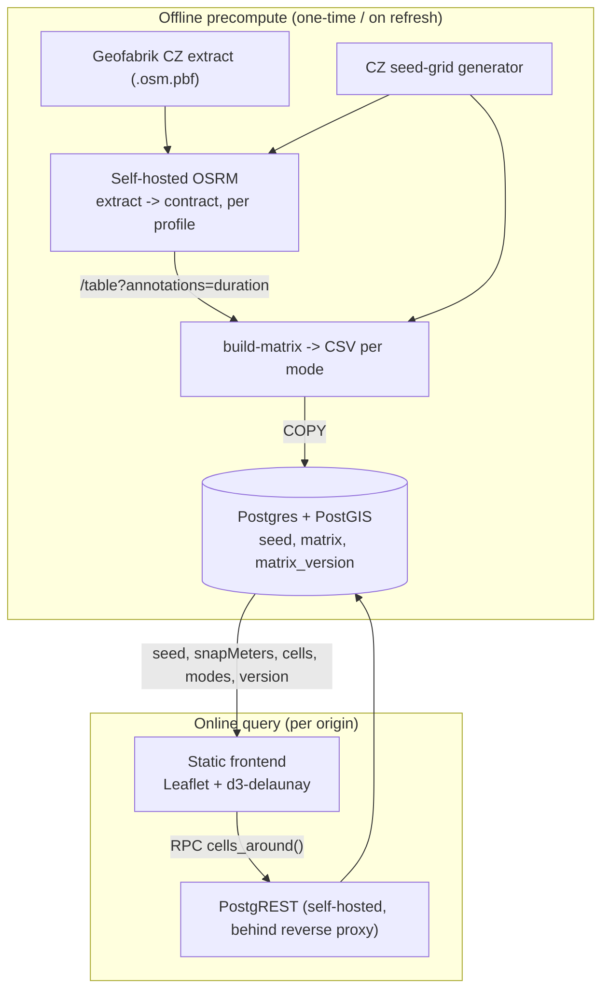
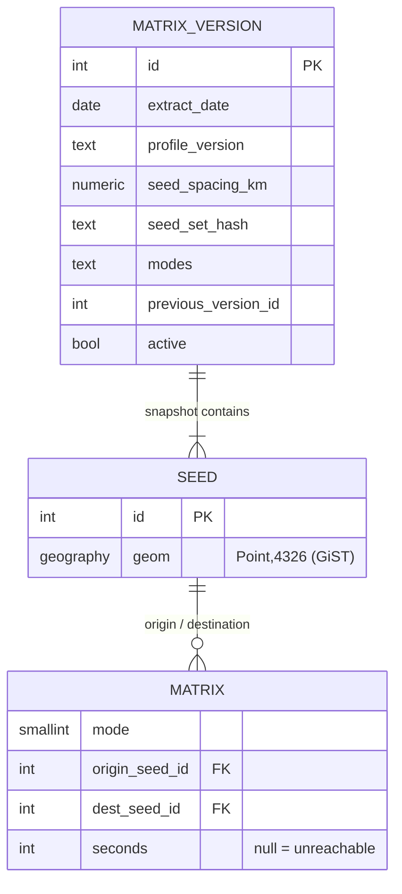
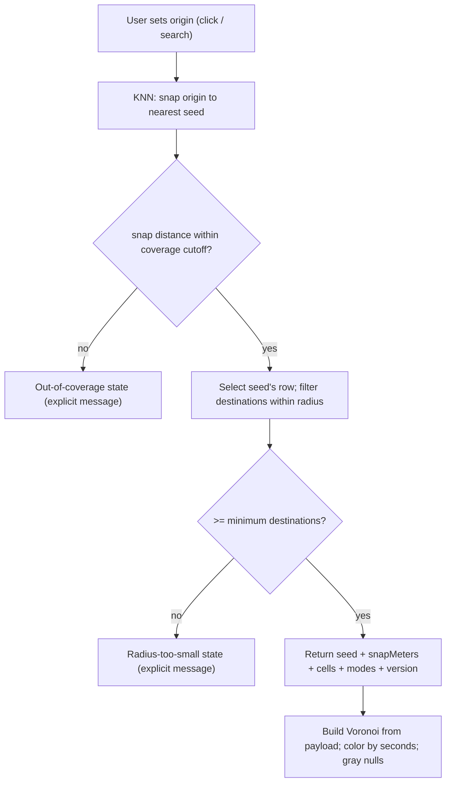

# feat: Pre-computed travel-time store for Czechia (Postgres/PostGIS)

## Summary

Replace distvis's live, rate-limited OSRM `table` calls with a pre-computed
road-travel-time store for Czechia on Postgres + PostGIS. A fixed seed grid
covers the country; the full seed-to-seed duration matrix (per mode) is built
once from a self-hosted OSRM and stored in Postgres. At query time a clicked
origin snaps to the nearest seed via an indexed PostGIS KNN lookup, and that
seed's precomputed times — filtered to the chosen radius — are returned in one
read-only RPC call to the existing Voronoi/coloring frontend.

---

## Problem Frame

The current data path (`js/routing.js`) computes travel times live against the
public FOSSGIS OSRM `table` service. That server is a free, shared, strictly
rate-limited demo: bursts return `429 Too Many Requests`, so the app caps routed
points at ~1200 (`MAX_ROUTE_POINTS`), keeps concurrency at 2, retries with
backoff, and ultimately degrades to a crow-flies estimate when the API is
unreachable. The result is slow first paints, frequent fallback-to-estimate, and
a hard ceiling on resolution — all driven by an external server distvis does not
control.

For a single, bounded country the travel-time relationships are static enough to
**precompute once and serve from a database**. This removes the per-query routing
call entirely, makes retrieval fast and deterministic, and lifts the
rate-limit-driven point cap. PostGIS provides the spatial machinery (snap a
clicked point to the nearest precomputed seed; filter destinations by radius);
OSRM, run locally with no rate limit, supplies the travel-time values during a
one-time precompute.

---

## Requirements

### Data store and precompute

- R1. Travel times for Czechia are precomputed once from a self-hosted OSRM (no
  per-query routing call) and stored in Postgres/PostGIS.
- R2. A fixed seed grid covers Czechia at a configurable spacing; the full
  seed-to-seed duration matrix is stored per travel mode (car, bike, foot).
- R3. The precompute can be re-run and swapped atomically with no read downtime;
  the active dataset carries a version/timestamp tied to the source OSM extract.

### Retrieval

- R4. A clicked origin is snapped to the nearest seed via an indexed PostGIS KNN
  query.
- R5. A single read returns, for the snapped seed, all destination seeds within
  the requested radius with their travel time in seconds.
- R6. Retrieval is exposed read-only to the browser with no secret keys and no
  bespoke server process, and is hardened (input clamps, statement timeout, RLS,
  least-privilege execute).
- R7. The response distinguishes in-radius-but-unreachable (`null`) from
  out-of-radius (absent), and carries the snapped seed's coordinates, the
  origin→seed snap distance, the available modes, and the dataset version.

### Frontend behavior, parity, and new states

- R8. Voronoi geometry is built from the returned destination seeds in payload
  order, preserving alignment between each cell and its travel time.
- R9. Origin snapping is surfaced to the user; clicks outside coverage and
  radii smaller than the grid resolution produce distinct, explicit states
  rather than a confident-looking but wrong map.
- R10. The cell-size control is bounded by the seed-grid resolution; selecting a
  spacing finer than the grid does not fabricate resolution.
- R11. The live-routing rate-limit machinery is retired: the straight-line
  estimate fallback, per-batch streaming/progress, and Overpass junction
  sampling are removed or replaced. A data-service outage yields an explicit
  retry error, not silent estimates.
- R12. Mode selection reflects precomputed coverage; an unavailable mode is
  disabled rather than silently substituted with another mode's data.

### Security and abuse resistance

- R13. The base tables are not reachable by the browser. Only the retrieval
  function(s) are anon-executable; direct REST access to `seed`/`matrix`/
  `matrix_version` returns no rows. The anon role is granted `EXECUTE` on the
  retrieval function(s) and nothing else.
- R14. The endpoint is protected against resource exhaustion: the function caps
  the rows it returns regardless of radius, a low `anon` statement timeout bounds
  a single query, and a per-IP rate limit at the reverse proxy in front of
  PostgREST bounds request volume. (Self-hosted on owned hardware — there is no
  metered-egress/denial-of-wallet exposure, so no spend alert is needed.)
- R15. All RPC inputs are fully validated server-side — coordinates rejected for
  null/NaN/Infinity and constrained to the Czech bounding box, radius clamped to
  a pinned maximum, mode whitelisted against the active snapshot — and invalid
  input yields a generic typed result, never a raw database error that leaks
  schema internals.
- R16. No privileged credential ever ships in the deployed artifact (the deploy
  uploads the repo root verbatim). Only the public PostgREST base URL and the
  anonymous JWT are present; the PostgREST JWT signing secret and any Postgres
  superuser/owner credentials are excluded by `.gitignore` and a CI guard.

### Data-store consistency

- R17. Seed identity is deterministic from grid geometry (not insert order), so
  the same physical cell always carries the same id; `matrix` references resolve
  to the correct `seed` geometry within a snapshot.
- R18. A publish is gated by validation that aborts on failure (referential
  closure of matrix→seed, zero-duration diagonal, expected row cardinality, mode
  coverage, value sanity) and transitions `seed`, `matrix`, and the active
  `matrix_version` row atomically in a single transaction; a reader never
  observes a mixed snapshot. A failed or bad publish is reversible.

### Rollout, rollback, and verification

- R19. Cutover is ordered as a release gate: the data store is fully loaded,
  version-active, and verified against the production project (including a
  from-deployed-origin RPC/CORS check) before the frontend swap reaches `main`
  (because merging to `main` is the production deploy).
- R20. A rollback affordance exists for the push-to-deploy model with no feature
  flag, and the new external dependency is monitored (RPC uptime probe; the
  removal of the estimate fallback makes a data-service outage user-visible).

---

## Key Technical Decisions

- KTD1 — Snap-to-seed retrieval model. The clicked origin resolves to the
  nearest precomputed seed; arbitrary origins are never routed on demand.
  Rationale: arbitrary origins cannot be precomputed, and the visualization
  already quantizes space into cells, so quantizing the origin to the same grid
  is consistent. Cost: a systematic origin-position error up to ~half the seed
  spacing (see R9, Risks).
- KTD2 — Store durations only, not distances. Rationale: the app colors by time;
  storing seconds halves the matrix and sidesteps OSRM's limitation that
  distance tables are implemented for CH only (duration tables work on any
  algorithm).
- KTD3 — `geography(Point,4326)` columns with a GiST index for both the KNN snap
  (`<->`) and the `ST_DWithin` radius filter. Rationale: keeps snap and radius in
  true meters with no projection step; perf cost is negligible at a few thousand
  seeds. Alternative considered: `geometry(Point,4326)` (planar, faster raw KNN
  ranking) — the nearest-seed result is identical at grid scale, so the simpler
  metric semantics of geography win.
- KTD4 — Matrix schema `matrix(mode smallint, origin_seed_id int, dest_seed_id
  int, seconds int)` with primary key `(mode, origin_seed_id, dest_seed_id)`.
  Rationale: that PK *is* the access path for "all destinations from one origin
  for one mode" — a clustered range scan, no secondary index needed. `seconds`
  is `integer` (long trips exceed `smallint`'s 32,767s ceiling).
- KTD5 — Store the full N×N matrix with explicit `null` for unreachable pairs;
  do not drop rows. Rationale: Czechia's max extent (~490 km) fits inside a
  single 450 km display radius, so radius-pruning removes almost nothing — and
  dropping unreachable rows would contradict the retrieval contract (R7), which
  needs an in-radius unreachable seed to be *present* with `seconds = null` to
  distinguish it from out-of-radius (absent). A single rule governs row absence:
  absent always means out-of-radius, never unreachable. (If storage ever forces
  pruning, the only safe form is dropping pairs whose great-circle distance
  already exceeds the maximum query radius — never within it.)
- KTD6 — Self-hosted OSRM, CH algorithm, three profiles, `--max-table-size`
  raised well above the default 100. Rationale: a bulk matrix cannot run against
  the public FOSSGIS server (the exact 429 problem this work removes); CH is the
  documented fit for a one-shot very-large matrix; durations-only keeps CH
  unconstrained.
- KTD7 — Bulk-load via `COPY` (load into an unindexed staging table, then build
  the PK, the `seed` geom GiST index, `CLUSTER`, and `ANALYZE` — all before the
  swap), then publish via a single transaction that renames `seed` + `matrix`
  and flips the active `matrix_version` row together. Rationale: fastest load at
  tens of millions of rows, and the metadata-only rename gives zero-downtime
  refresh — but only if all renames *and* the active-flag flip are in one
  transaction (the RPC reads `seed` for the snap and `matrix` for the row, so a
  two-step swap would let a call straddle two snapshots). The table currently
  named `matrix`/`seed` IS the served data; the `active` row is descriptive
  metadata, never consulted at query time to choose a data source. The outgoing
  tables are retained as `*_prev` (not dropped) so rollback is the mirror
  rename. See R18, U4.
- KTD8 — Browser → Postgres via PostgREST on the user's self-hosted Postgres (no
  Supabase), with the base tables in a private schema that is **not** added to
  PostgREST's exposed schema (`db-schemas`). Only the retrieval function is
  anon-reachable. The function is `STABLE`, `SET search_path = ''` (every
  reference schema-qualified, including its own tables), `EXECUTE` granted only
  to `anon` and revoked from `public`, with server-side input clamps and a low
  `anon` statement timeout. Rationale: exposing the base tables to `anon` makes
  PostgREST auto-generate `/<schema>/matrix` and `/seed` REST endpoints that an
  attacker can page directly, reconstructing the whole matrix and bypassing every
  clamp on the RPC — so the tables must simply not be exposed. Privilege model:
  either the function is `SECURITY DEFINER` owned by a least-privilege role that
  can read the private schema, or `SECURITY INVOKER` with `anon` granted read on
  the private schema while that schema stays out of PostgREST's exposed list; the
  plan picks one in U5. Cost: the deployed site takes a runtime dependency on the
  user's PostgREST endpoint and bakes a public base URL + anon JWT into a static
  artifact — the endpoint is only ever as safe as this hardening, so every future
  RPC must repeat it. See R13, R15.
- KTD11 — Transport-isolating data seam. `js/datasource.js` is the single module
  that knows the transport (PostgREST URL convention, anon JWT, RPC parameter
  names); it returns the frontend's own shape `{ seed, snapMeters, cells, modes,
  version }`, and `compute()` consumes only that shape. Rationale: the current
  app deliberately values backend swappability (the documented `OSRM_BASE` knob),
  which this work removes; isolating transport in one module preserves that
  property — the backend can be swapped (PostgREST ↔ custom API ↔ static
  precomputed JSON) without touching `compute()`, and a static-JSON datasource is
  the natural future degraded/offline mode (see Scope deferred work). This is
  ordinary separation of concerns, not a heavyweight abstraction: the contract is
  the return shape, enforced by keeping transport in `datasource.js` — a grep that
  `js/main.js` stays transport-free is a useful guideline, not a hard gate. See
  U6, U9.
- KTD12 — Resource-exhaustion controls, right-sized for a self-hosted box. The
  per-query clamps and statement timeout (KTD8) bound a single call; a public
  anon endpoint also needs to bound aggregate load on the user's Postgres. Two
  controls suffice: a hard server-side row cap in the function (already required
  by R14), and a per-IP rate limit at the reverse proxy the user puts in front of
  PostgREST. There is no metered service to drain, so no spend alert and no edge
  rate-limiter infrastructure is warranted — the proxy the user already needs for
  TLS/CORS carries the rate limit. See R14, Risks.
- KTD9 — Remove the crow-flies estimate fallback and the progressive
  streaming/colorize path. Rationale: both exist to cope with live-routing rate
  limits, which no longer occur; a single RPC returns the whole vector at once,
  and an estimate computed from an already-snapped origin would compound two
  errors while masquerading as data. Accepted tradeoff (decided — hard cutover):
  today the app *always* renders something offline, whereas after this change a
  data-service outage is a hard "unavailable" state (an honesty improvement — no
  fake data — but an availability regression). The fallback, the live-OSRM path
  (`js/routing.js`), and the streaming path are removed **at cutover**, not
  deferred behind a toggle; rollback is a validated `git revert` (Operational
  Notes). The natural future degraded mode, if wanted, is a static-JSON
  datasource via the KTD11 seam — not the crow-flies estimate.
- KTD10 — Seed spacing and mode coverage are explicit configuration knobs.
  Rationale: storage and one-time precompute cost grow quadratically with seed
  count, but on self-hosted Postgres the only ceiling is the user's disk (no
  tier cap), so even a 5 km / 3-mode matrix (~3 GB) is comfortable and finer
  resolution is feasible if the disk allows — the constraint is precompute time
  and client render cost (U7), not a storage tier. The schema, precompute, and
  RPC are spacing-agnostic so the resolution can be raised later without code
  changes. **Launch target (decided): 5 km spacing, all three modes
  (car/bike/foot)** — ~3,600 seeds, ~13M ordered pairs/mode, ~3 GB total; the
  ~2.5 km worst-case origin-snap error (KTD1) is acceptable.

---

## High-Level Technical Design

Two data paths: an **offline precompute** that runs once (and on refresh), and an
**online query** that runs per click. Only the online path is in the deployed
static site; the offline path is operator tooling.



Data model — `seed` and `matrix` belong to a versioned snapshot; refresh swaps
them atomically.



Query-time flow — coverage and sparsity are first-class terminal states, not
errors.



---

## Output Structure

New and modified files (offline tooling lives outside the deployed static path;
`node_modules` and built `.osrm` artifacts are git-ignored):

```
db/
  schema.sql         # private-schema seed, matrix, matrix_version; geography GiST
  rpc.sql            # cells_around() -> single jsonb doc; grants, clamps, privs
  checks.sql         # assertion queries: schema, seed, load gate, RPC
precompute/
  README.md          # operator runbook: OSRM docker pipeline, load, swap, rotate
  package.json       # offline-only deps (kept out of the deployed root path)
  seeds.mjs          # generate CZ seed grid (deterministic ids) -> seeds.csv
  build-matrix.mjs   # batch OSRM /table per mode -> matrix.csv (null retained)
  load.sql           # COPY -> staging, PK, validate gate, atomic swap, version
  docker-compose.yml # optional: osrm-routed per profile
js/
  datasource.js      # NEW: transport-isolating data seam (sole transport-aware module)
  config.js          # NEW: PostgREST base URL + anon JWT + active version
  main.js            # MODIFIED: compute() rewired to the normalized payload
  routing.js         # DELETED: live OSRM table client (hard cutover)
  nodes.js           # RETIRED: Overpass junction sampling (deleted)
  geo.js             # shared kernel (browser + precompute); stays env-neutral
  colors.js          # unchanged
AGENTS.md            # MODIFIED: invariants + OSRM_BASE -> DATA_SOURCE knob
README.md            # MODIFIED: data-path docs rewritten
.gitignore           # MODIFIED: exclude JWT signing secret / DB creds / .env from the artifact
```

The tree is a scope declaration, not a constraint; per-unit `Files:` lists are
authoritative. The precompute scripts are shown as Node ESM (`.mjs`) for
consistency with the browser ES modules and Node 18+ built-in `fetch`; Python is
an equally valid choice if preferred.

---

## Implementation Units

Grouped into three milestones. Phase 1 stands up the data store end-to-end and
is independently verifiable before any frontend change. Phase 2 swaps the
frontend onto it. Phase 3 is operations and docs.

Note on testing: the project ships no automated test harness (a pure static
site — see AGENTS.md). "Test scenarios" below are executed as **SQL assertion
queries** (`db/checks.sql`) for the data/RPC units and as **manual browser
checks** for the frontend units; they name concrete inputs and expected
outcomes so verification is unambiguous.

### Phase 1 — Backend data store (offline)

### U1. Database schema and PostGIS provisioning

- Goal: provision PostGIS on the self-hosted Postgres and create the three tables
  in a private (non-PostgREST-exposed) schema, so data can be loaded and queried
  only through the retrieval function.
- Requirements: R1, R2, R6, R13, R17.
- Dependencies: none.
- Files: `db/schema.sql`, `db/checks.sql`.
- Approach: `CREATE EXTENSION postgis` into a dedicated `extensions` schema.
  Place `seed`, `matrix`, and `matrix_version` in a **private schema that is not
  in PostgREST's `db-schemas` exposed list**, so no auto-generated table REST
  endpoints exist for them (KTD8, the P0 exposure fix). Create
  `matrix_version(id, extract_date, profile_version, seed_spacing_km,
  seed_set_hash, modes, expected_row_count, actual_row_count,
  previous_version_id, active)`; `seed(id int PK, geom geography(Point,4326) not
  null)` with a GiST index built post-load in U4; `matrix(mode smallint,
  origin_seed_id int, dest_seed_id int, seconds int)` — created *without* its PK
  initially (built post-load for COPY speed). `anon` is granted nothing on these
  tables directly; access is solely via the U5 function. Keep RLS enabled as
  defense-in-depth in case a table is ever accidentally exposed later. See KTD3,
  KTD4, KTD8.
- Patterns to follow: PostGIS `geography` column + GiST index; PostGIS
  typmod-constrained column declaration (`geography(Point,4326)`, not bare
  `geography`); the PostgREST "private schema, expose only functions" pattern
  (base tables in a schema absent from `db-schemas`).
- Test scenarios:
  - PostGIS present: `SELECT postgis_version();` returns a version. Covers R1.
  - No REST table surface: a direct `GET /matrix` and `/seed` against PostgREST
    with the anon JWT returns not-found / 401 / empty, not rows. Covers R13.
  - `anon` grant audit: enumerating `anon`'s privileges shows no `SELECT`/
    `INSERT`/`UPDATE` on the base tables. Covers R13.
  - Column types: `seed.geom` is `geography(Point,4326)`; `matrix.seconds` is
    `integer` and nullable. Covers R5, R7 (null-capable `seconds`).
- Verification: `db/schema.sql` applies cleanly on a fresh database; the base
  tables are unreachable via REST; `db/checks.sql` schema-section passes.

### U2. Czechia seed-grid generation and load

- Goal: produce the fixed set of seed points covering Czechia at the configured
  spacing, with deterministic ids, and load them into `seed`.
- Requirements: R2, R4, R17.
- Dependencies: U1.
- Files: `precompute/seeds.mjs`, `precompute/README.md` (seed section),
  `db/checks.sql`.
- Approach: generate a hex grid over the Czech bounding box anchored to a
  **fixed reference corner** (not a moving click origin), clipped to a Czech
  boundary polygon (a coarse national outline is sufficient; sourcing it is an
  Open Question). Note `js/geo.js`'s `hexGrid` centers on the *per-click* origin,
  so reuse its `offsetKm`/`cosLat` scaling concept but emit an **absolute** grid
  from the fixed anchor — otherwise `(row, col)` indices aren't stable. Seed `id`
  is a **deterministic function of the grid cell** (e.g. an encoding of the
  quantized `(row, col)` index), never a `SERIAL` or insert-order counter, so the
  same physical cell always carries the same id across regenerations (R17). Emit
  `seeds.csv` of `(id, lng, lat)`; load via COPY, building `geom` with
  `ST_SetSRID(ST_MakePoint(lng,lat),4326)::geography`. Record a `seed_set_hash`
  (hash of the sorted `(id, rounded geom)` set) for the snapshot — it authorizes
  a matrix-only refresh and detects accidental id drift. Default spacing per
  KTD10. Note: `js/geo.js` is now a shared kernel imported by both the browser
  app and this Node script, so it must stay environment-neutral (pure functions,
  no DOM/Node-specific APIs) — see U9.
- Patterns to follow: `js/geo.js` `offsetKm`/`haversineKm` and longitude
  scaling by `cos(lat)` for regular cells at Czech latitudes (the existing
  equirectangular invariant).
- Test scenarios:
  - Count is in the expected band for the configured spacing (e.g. ~900 at
    10 km, ~3,600 at 5 km). Covers R2.
  - Every seed lies inside the Czech boundary (point-in-polygon assertion);
    spot-check that border regions are covered and the sea/foreign area is not.
  - Nearest-seed sanity: KNN from Prague centre
    (`ST_MakePoint(14.42,50.08)`) returns a seed within one grid step. Covers R4.
  - `ST_MakePoint(lng,lat)` ordering: a known seed round-trips to the right
    lng/lat (guards the classic lat/lng swap).
  - Determinism: regenerating the grid twice (same spacing/bbox/boundary)
    produces byte-identical `(id, lng, lat)` rows and the same `seed_set_hash`.
    Covers R17.
- Verification: `seed` row count matches the generated CSV; all
  point-in-boundary, KNN, and determinism assertions in `db/checks.sql` pass.

### U3. Self-hosted OSRM precompute pipeline

- Goal: stand up OSRM locally for all three profiles and compute the full
  seed-to-seed duration matrix per mode into COPY-ready CSV.
- Requirements: R1, R2.
- Dependencies: U2 (needs the seed set as the coordinate list).
- Files: `precompute/build-matrix.mjs`, `precompute/docker-compose.yml`,
  `precompute/README.md` (OSRM section).
- Approach: download the Geofabrik `czech-republic-latest.osm.pbf`; run
  `osrm-extract -p` then `osrm-contract` (CH) for each of `car.lua`,
  `bicycle.lua`, `foot.lua`; serve each `osrm-routed --algorithm ch` on its own
  port with `--max-table-size >= N` (the full seed count). Note: `--max-table-size`
  bounds the *total coordinates* in a request, and `destinations=all` places all
  N seeds in every request — so it must be ≥ N regardless of how few sources are
  batched. `build-matrix.mjs` posts the full seed list once as the coordinate
  array and requests `sources=<batch>&destinations=all&annotations=duration`,
  reading the row-major `durations[i][j]` (seconds, `null` = unreachable). Batch
  sources to bound per-request compute/memory (this does *not* reduce the
  coordinate count `--max-table-size` checks); write `(mode, origin_id, dest_id,
  seconds)` tuples to `matrix.csv`, emitting an **explicit null** for unreachable
  pairs (rows are never dropped — KTD5, so that the RPC can return in-radius
  unreachable seeds distinctly from out-of-radius). Record the count of null
  pairs per mode for the cardinality gate in U4. See KTD2, KTD6.
- Execution note: validate one small batch end-to-end (e.g. 10×10 around Prague)
  and assert symmetry/zeros on the diagonal before launching the full run.
- Patterns to follow: the existing `osrmTable()` request shape in
  `js/routing.js` (the `table` URL and `annotations=duration` are identical) —
  only the base URL and batching differ.
- Test scenarios:
  - Diagonal is zero: `durations[i][i] == 0` for sampled seeds. Covers R1.
  - A known city pair (e.g. Prague→Brno by car) returns seconds within a
    plausible band (~2.5–3.5 h) and is greater than the bike value, which is
    greater than nothing routed for foot at that distance (foot may be `null`).
  - Output cardinality: `matrix.csv` row count equals
    `modes × seeds × seeds` — unreachable pairs are retained as `null` rows,
    never dropped (KTD5). Covers R2.
  - `null` handling: a deliberately isolated/ferry-only point yields `null`,
    and that pair is written as a retained row with `seconds = null` (not
    dropped). Covers R7, KTD5.
- Verification: a full per-mode run completes against local OSRM with no rate
  limiting; the sampled-pair and diagonal assertions hold.

### U4. Matrix bulk load and versioned atomic-swap snapshot

- Goal: load `matrix.csv` into Postgres fast, build the access path, validate
  the snapshot, and publish it atomically and reversibly with a recorded version.
- Requirements: R1, R3, R17, R18.
- Dependencies: U1, U3.
- Files: `precompute/load.sql`, `precompute/README.md` (load/swap section),
  `db/checks.sql`.
- Approach: `COPY` into unindexed staging tables (separate namespace, never the
  live tables); verify COPY's reported row count equals the source line count;
  `ADD PRIMARY KEY (mode, origin_seed_id, dest_seed_id)`; build the `seed` geom
  GiST index; `CLUSTER matrix` on the PK (safe — `ACCESS EXCLUSIVE` on staging,
  which no one reads); `ANALYZE` both staging tables (so the swapped-in tables
  arrive with fresh statistics and the first post-swap query doesn't hit a
  seq-scan cliff). Then run the pre-activation **validation gate** (below),
  aborting the publish on any failure and leaving the previous active snapshot
  untouched. On success, publish in **one transaction**: rename outgoing
  `seed`/`matrix` to `seed_prev`/`matrix_prev`, rename staging into `seed`/
  `matrix`, and flip `matrix_version.active` — all together (KTD7). Record
  `previous_version_id`. The rename changes table oids, so issue
  `NOTIFY pgrst, 'reload schema'` after the swap as a **mandatory** step (not
  conditional) and confirm a known RPC call succeeds against the new snapshot —
  PostgREST caches the schema and will not pick up the swap otherwise. Referential
  integrity between `matrix` and `seed` is enforced by the validation gate's
  assertion query, **not** a DB-level FOREIGN KEY (a real FK would complicate the
  rename-based swap and slow the load for no benefit here). Validation gate (R18):
  referential closure (every matrix seed id exists in `seed`), zero-duration
  diagonal for every seed and mode, cardinality (`count(matrix) == modes × N²`,
  all pairs retained including nulls — KTD5), mode coverage equals
  `matrix_version.modes`, value sanity (`seconds >= 0` and below a
  country-diameter cap), and `seed_set_hash` consistency. See KTD7.
- Patterns to follow: PostgreSQL COPY best practice (load then index, single
  transaction, raise `maintenance_work_mem`); metadata-only `ALTER TABLE ...
  RENAME` for the swap.
- Test scenarios:
  - Round-trip: a sampled `(mode, origin, dest)` from `matrix.csv` equals the
    queried `seconds`. Covers R1.
  - PK present and used: `EXPLAIN` of "all destinations for one origin/mode"
    shows an index/range scan, not a seq scan. Covers R5 readiness.
  - Validation gate rejects bad data: a staging set with a dangling
    `origin_seed_id`, a missing/non-zero diagonal entry, a short row count, a
    missing mode, or a negative duration each abort the publish and leave the
    prior active snapshot serving. Covers R18.
  - Referential integrity post-swap: every `matrix` seed id resolves to a `seed`
    row in the same active snapshot. Covers R17, R18.
  - Atomic swap (structural): assert the publish SQL wraps all renames and the
    active-flag flip in a single `BEGIN … COMMIT`. Atomicity then follows from
    PostgreSQL's transactional DDL — a reader sees the whole old or whole new
    snapshot, never a mix — so no concurrent-harness test (which this project's
    SQL-assertion + manual-browser model can't run) is needed. Covers R3, R18.
  - `matrix_version` has exactly one `active = true` row after publish, and its
    `previous_version_id` points at the retained `*_prev`. Covers R3.
  - Rollback: the mirror rename (restore `*_prev`, re-flip active) returns the
    prior snapshot to service in one transaction. Covers R18.
- Verification: full load completes; the validation gate passes for good data
  and aborts for each injected fault; `db/checks.sql` load-section assertions
  pass; `EXPLAIN` confirms the PK access path; a dry-run rollback succeeds.

### U5. Read-only retrieval RPC and security hardening

- Goal: expose a single hardened RPC that snaps the origin, filters destinations
  by radius, and returns one self-describing document — including capabilities
  and version — that the frontend consumes.
- Requirements: R4, R5, R7, R12, R13, R14, R15.
- Dependencies: U1, U4.
- Files: `db/rpc.sql`, `db/checks.sql`, `precompute/README.md` (RPC section).
- Approach: `cells_around(p_lng, p_lat, p_mode, p_radius_m)` returns a **single
  `jsonb` document** `{ seed:{lat,lng}, snapMeters, modes, version,
  cells:[{lat,lng,seconds|null}] }` — one document, not a `SETOF` rows, so the
  PostgREST query-string surface (`?select`/`?order`/`?limit`/`Range`) cannot be
  layered onto the result to reorder or page it, and the capabilities/version
  collapse into the same call (R7, R12). `STABLE`, with the privilege model from
  KTD8 chosen explicitly: `SECURITY DEFINER` owned by a least-privilege role that
  can read the private schema (preferred), with `SET search_path = ''` and every
  reference schema-qualified — its own tables to the private schema, PostGIS to
  `extensions.*`. Snaps via `ORDER BY geom <-> point LIMIT 1`; the snap and the
  row are read in one statement (single snapshot, no straddle). In-radius
  `null`-seconds seeds are included; out-of-radius seeds are absent (R7, KTD5).
  Input contract (R15): reject `p_lng`/`p_lat` that are null/NaN/Infinity or
  outside the Czech bounding box (short-circuit to the out-of-coverage result,
  not a KNN over a garbage point); `p_radius_m` → `LEAST(value, RADIUS_MAX)` with
  `RADIUS_MAX` pinned (≤ ~450 km), reject null/NaN/negative; whitelist `p_mode`
  against the active snapshot. Hard-cap the returned `cells` count regardless of
  radius (R14). On invalid input, return a generic typed document the frontend
  branches on — never a raised SQL exception that leaks schema/object names
  (R15). No dynamic SQL over user input. `REVOKE EXECUTE ... FROM public; GRANT
  EXECUTE ... TO anon;` and grant `anon` nothing else (R13). Lower `anon`
  `statement_timeout`. See KTD8, KTD12.
- Patterns to follow: PostgreSQL/PostgREST function-security guidance (`STABLE`,
  pinned empty `search_path`, narrow `EXECUTE` grant, `SECURITY DEFINER` owned by
  a non-superuser least-privilege role); return a JSON document rather than raw
  WKB geometry.
- Test scenarios:
  - Happy path: `cells_around(14.42,50.08,0,50000)` returns a document whose
    `cells` are all within 50 km of the populated `seed`, with `snapMeters`,
    `modes`, and `version` set. Covers R5, R7.
  - Snap correctness: a point 1 m from a seed and a point near half-spacing away
    both snap to the expected seed; `snapMeters` reflects the offset. Covers R4.
  - Radius boundary: a destination just inside the radius is included and one
    just outside excluded (geography meters, not degrees).
  - Unreachable vs absent: an in-radius seed with `null` seconds appears in
    `cells` with `seconds = null`; an out-of-radius seed does not appear. Covers
    R7.
  - Input hardening: `cells_around(NULL,…)`, `NaN`/`Infinity` coords, coords
    outside the bbox, and a null/negative/oversized `p_radius_m` each return a
    clean typed result (out-of-coverage or clamped) — never the whole matrix,
    never a raw DB error with schema names. An invalid `p_mode` is rejected.
    Covers R15.
  - Result-surface lockdown: a PostgREST request adding `?limit=10000000&
    order=seconds` or a `Range` header to the RPC cannot enlarge or reorder the
    document beyond its internal cap. Covers R14.
  - Privilege: `anon` can `EXECUTE` only `cells_around` (and any version fn) and
    has no base-table grants; `public` cannot execute. Covers R13.
  - Function runs under `search_path = ''` set at the function level (not the
    session), proving every object is qualified. Covers R15.
  - Capabilities: `modes`/`version` in the document match the active snapshot.
    Covers R12.
- Verification: `db/checks.sql` RPC-section passes; a browser `fetch` to
  `<postgrest-base>/rpc/cells_around` with the anon JWT returns the expected
  document with no internal error text on bad input.

### Phase 2 — Frontend integration

### U6. Precompute data-source client module

- Goal: add the browser-side client that calls the RPC and returns a normalized,
  transport-isolated payload, as the sole transport-aware module replacing the
  live OSRM table client.
- Requirements: R5, R7, R11, R12, plus the KTD11 seam contract.
- Dependencies: U5.
- Files: `js/datasource.js` (new), `js/config.js` (new).
- Approach: `js/config.js` holds the PostgREST base URL, the anonymous JWT
  (public by design), and the active dataset version. `js/datasource.js` exposes
  one function `fetchCells(origin, mode, radiusKm, { signal })` that calls
  `<base>/rpc/cells_around` via `fetch` (no SDK needed), honors the `AbortSignal`
  (preserve the per-run abort contract from AGENTS.md), and returns the
  **frontend's own vocabulary** `{ seed:{lat,lng}, snapMeters,
  cells:[{lat,lng,seconds|null}], modes, version }`. The return shape is the
  contract; the transport (PostgREST URL convention, anon JWT, RPC parameter
  names) lives entirely inside this module so the backend can be swapped without
  touching `compute()` (KTD11). It maps transport/HTTP failures to an explicit
  "data service unavailable" state (no estimate fallback — KTD9, R11) and
  out-of-coverage / empty results to typed states the caller branches on. CORS is
  restricted to the deployed Pages origin at the reverse proxy in front of
  PostgREST (defense-in-depth; not the abuse control — KTD12 is).
- Patterns to follow: the `AbortController`/`signal` threading and
  `AbortError`-vs-failure distinction in `js/routing.js`; module-per-concern ES
  module style (no framework).
- Test scenarios (manual browser):
  - A valid origin returns the normalized payload with `cells` aligned to seed
    coordinates and a populated `version`. Covers R5, R7.
  - Aborting an in-flight request (rapid re-click) rejects with `AbortError` and
    is swallowed by the caller, not surfaced as an error.
  - With the endpoint unreachable (offline / wrong URL), the call yields the
    explicit unavailable state — never a crow-flies estimate. Covers R11.
  - Requesting a mode absent from `modes` yields the unavailable-mode state.
    Covers R12.
  - Seam boundary (guideline): a grep confirms `js/main.js` keeps transport
    detail out — no PostgREST paths, anon JWT, or RPC parameter names — with all
    of it confined to `js/datasource.js`/`js/config.js`. Covers the KTD11 seam.
- Verification: from the running app, a click populates the payload; DevTools
  shows a single RPC round-trip and no OSRM/Overpass requests; the grep seam
  check passes.

### U7. Rewire compute() pipeline and confidence/coverage states

- Goal: drive the Voronoi/coloring pipeline from the RPC payload and implement
  the new coverage/sparsity/confidence states, retiring the live-routing
  machinery.
- Requirements: R8, R9, R10, R11, R12.
- Dependencies: U6.
- Files: `js/main.js` (modified), delete `js/routing.js`, delete `js/nodes.js`
  (hard cutover — decided).
- Approach: in `compute()`, build `inner`/`cells`/`durations` **from the RPC
  payload in its own order** (pair coordinates with seconds; never zip two
  independently ordered lists) so the index-alignment invariant holds against
  the payload, not a separately generated grid (R8). Restore the edge ring:
  today `hexGrid` appends off-map `edge` points that bound the outermost Voronoi
  cells, but the RPC returns only in-radius seeds. Synthesize the ring on the
  client — generate synthetic points one grid-step outside the returned cells
  (around the radius circle / their hull), append them **after** the payload
  cells with an `edge` flag, and exclude them from coloring — preserving the
  inner-first / edge-last index-alignment that `js/geo.js` relies on today.
  Without it, perimeter cells render large and distorted (a regression the "keep
  the visualization as-is" scope forbids). Bound render cost: `MAX_ROUTE_POINTS` also
  capped Leaflet/Delaunay render cost, not just routing volume; a 450 km /
  fine-grid payload can be thousands of cells, so cap the displayed cell count
  (sub-sample or coarsen the displayed grid at large radii) independent of the
  now-removed routing cost. Redefine confidence: the
  per-destination `snapMeters` graying no longer applies (seeds sit on the grid)
  — instead gray/flag the whole result when the origin→seed snap distance
  exceeds a spacing-scaled threshold (R9, replaces the old `snapLimitMeters`
  logic). Add explicit terminal states: out-of-coverage (snap beyond cutoff),
  radius-too-small (fewer than the minimum destinations to tessellate), and
  service-unavailable — each with its own status-line message distinct from a
  generic error (R9, R11). Clamp the cell-size control's floor to the seed
  spacing and relabel/disable the sub-grid range (R10). Keep `null` seconds →
  gray "unreachable" (existing convention). Delete the `estimate` fallback,
  `source` branching, and the per-batch `onProgress` streaming/dimmed-then-color
  path (single RPC arrives at once) (R11, KTD9) — removed now, not toggled (hard
  cutover). Reflect available modes in the mode selector (R12). The origin marker
  shows the snapped seed plus a "snapped N km" note, and tooltip distances are
  measured from the seed (R9).
- Execution note: this is the highest-risk unit (it rewrites the core pipeline
  and several invariants). Land it behind a clear before/after manual check
  matrix; verify the payload-order alignment first since a silent mismatch
  miscolors with no error.
- Patterns to follow: the existing `compute()` structure, the three-state
  `durations` convention (`undefined`/`null`/number), the `colorize` and
  `dataDomainMax` p98 rescale, and the equirectangular Voronoi tessellation —
  all in `js/main.js`.
- Test scenarios (manual browser):
  - Payload alignment: an origin in central CZ colors cells correctly; verify a
    near cell is greener than a far cell (guards coordinate↔seconds pairing).
    Covers R8.
  - Snap surfacing: clicking 1 m from a seed vs near half-spacing both render,
    and the "snapped N km" note reflects the offset; the marker sits on the
    seed. Covers R9.
  - Out of coverage: clicking Vienna / mid-sea / a deliberate grid gap shows the
    explicit out-of-coverage state, not a colored map. Covers R9.
  - Radius too small: a radius below the seed spacing shows the radius-too-small
    message, not a one-cell map or a crash. Covers R9, R10.
  - Cell-size floor: choosing a spacing finer than the grid does not add cells;
    the control communicates the floor. Covers R10.
  - Unreachable: an in-radius `null` seed renders gray with an "unreachable"
    tooltip. Covers R8.
  - No legacy traffic: switching modes / moving the origin issues only RPC
    calls; no OSRM or Overpass requests appear; killing the endpoint shows the
    retry error, never estimates. Covers R11.
  - Mode coverage: a mode absent from the snapshot is disabled in the selector.
    Covers R12.
- Verification: the full manual matrix above passes against the running app with
  the live RPC; `js/routing.js` and `js/nodes.js` are deleted and no longer
  imported (a grep confirms no remaining references).

### U8. Cache re-key and dataset-version surfacing

- Goal: make the in-memory result cache effective under snapping and correct
  across refreshes, and show the data's provenance.
- Requirements: R3, R7.
- Dependencies: U7.
- Files: `js/main.js` (modified).
- Approach: re-key `routeCache` from clicked `origin.lat/lng` to
  `seedId | mode | radius | datasetVersion` so the many clicks that snap to one
  seed share a single entry and a server refresh (new version) naturally
  invalidates stale entries. Surface the dataset version/extract date as an
  attribution line ("road data as of <date>"). See KTD7 (version), flow-analysis
  M1/M2.
- Patterns to follow: the existing `routeCache` Map and key construction in
  `js/main.js`; the existing attribution/status-line rendering.
- Test scenarios (manual browser):
  - Two clicks that snap to the same seed (same mode/radius) reuse one cache
    entry (second is instant, no RPC). Covers retrieval efficiency.
  - Bumping the active version server-side and reloading invalidates the cache
    (next click re-fetches). Covers R3.
  - The attribution line shows the active extract date from the payload. Covers
    R7.
- Verification: cache-hit behavior observable in DevTools (no RPC on snap-equal
  re-click); attribution reflects the active version.

### Phase 3 — Operations and docs

### U9. Documentation and invariants update

- Goal: rewrite the project docs so the new data path and its invariants are the
  documented reality, and capture the operator runbook (precompute, refresh,
  cutover gate, rotation, monitoring).
- Requirements: R3, R11, R16, R19, R20.
- Dependencies: U7, U8.
- Files: `AGENTS.md` (modified), `README.md` (modified), `precompute/README.md`
  (consolidated runbook), `.gitignore` (modified).
- Approach: in `AGENTS.md`, replace the live-OSRM architecture and the
  invariants that no longer hold — index alignment now anchors to the RPC
  payload order (not a generated grid); the three-state `durations` convention
  survives but its producer is the RPC, not concurrent batches; `snapMeters`
  "unreliable" is redefined as origin-snap confidence; the rate-limit/concurrency
  knobs are gone. Replace the documented `OSRM_BASE` "Key knob" with its
  successor `DATA_SOURCE` (the transport-isolating swap lever from KTD11: the
  `js/datasource.js` body / `js/config.js`, return shape fixed, transport
  swappable). Record the new external dependency (the self-hosted Postgres +
  PostgREST endpoint) and the consistency
  invariant: at all times the live `seed`, live `matrix`, and the active
  `matrix_version` row describe the same build (same `seed_set_hash`,
  `profile_version`, `extract_date`); publish/rollback transition all three
  atomically. Note `js/geo.js` is now a shared kernel (browser + Node precompute)
  and must stay environment-neutral. In `README.md`, rewrite the "how travel
  times are computed" sections to describe precompute + snap + radius retrieval,
  and document coverage limits and data age. `precompute/README.md` is the
  operator runbook: extract→contract→table→COPY→validate→swap; the refresh
  procedure (re-extract, rebuild, atomic swap, version bump, matrix-only vs
  grid-changing); the credential model (anon JWT public; the PostgREST JWT
  signing secret and Postgres owner/superuser creds never in the repo or deployed
  artifact — `.gitignore` + a CI guard since the deploy uploads the repo root
  verbatim) and JWT/secret rotation steps; the reverse-proxy setup (TLS, CORS to
  the Pages origin, per-IP rate limit); and a recommended (not gating) uptime
  probe on the RPC.
- Patterns to follow: the existing structure and tone of `AGENTS.md`
  ("Invariants you must preserve", "Key knobs") and `README.md`.
- Test scenarios: mostly documentation — no behavioral tests for the prose.
  `Test expectation: none -- docs only; correctness is that claims match the
  shipped behavior from U1–U8.` The one verifiable artifact is the secret guard:
  a check (CI or pre-publish) asserts no JWT signing secret / DB owner creds /
  `.env` is present in the deployable artifact. Covers R16.
- Verification: a reader following `precompute/README.md` can reproduce a refresh
  and a rollback; `AGENTS.md` invariants (including the new consistency invariant
  and the `DATA_SOURCE` knob) match the code after U7/U8; the secret guard passes
  and finds no privileged credential in the artifact; no stale references to
  OSRM rate limits, Overpass, or the estimate fallback remain.

---

## Scope Boundaries

### Deferred to follow-up work

- Finer resolution (e.g. 2.5 km), which is a config change (KTD10) but pushes
  storage into partition-by-mode territory and a larger precompute run.
- Reinstating the "road junctions" seed strategy (the retired `js/nodes.js`
  Overpass path) as an alternate *precomputed* seed set rather than the uniform
  hex grid.
- HTTP/CDN caching of the RPC response (PostgREST emits weak cache headers);
  acceptable to defer since the in-memory cache plus version-keying covers the
  session, and the snapshot changes infrequently.

### Outside this work

- More than one country / multi-country coverage and cross-border routing.
- Live or historical traffic (precompute is a free-flow snapshot, as today).
- Keeping a live per-click OSRM path for the exact clicked origin as the primary
  data path (the snap-to-seed alternative — see Alternatives Considered). A live
  origin→seed leg layered on top of the precompute is noted there as a possible
  accuracy enhancement, not in this scope.
- Storing road distance in addition to duration (KTD2 — the app colors by time).
- Changing the visualization itself (Voronoi tessellation, color scale, legend
  behavior all stay as-is).

---

## Alternatives Considered

The review surfaced that the precompute approach must be justified against
simpler baselines — especially since the precompute itself requires standing up
OSRM. Each alternative differs in *architecture*, not detail.

- Self-hosted OSRM with live per-click queries (repoint `OSRM_BASE`). AGENTS.md
  already names this as the drop-in fix for the 429s — identical request shape,
  no schema, keeps exact-origin routing, cross-border coverage, and the
  always-renders fallback. It is the strongest alternative and removes the rate
  limit on its own. Why the precompute is still chosen *for this setup*: it
  requires OSRM only **transiently** (run once for the precompute, then torn
  down), and serves from the Postgres the user **already operates** — whereas the
  live-query path requires a **new always-on OSRM service** the user has not
  committed to running and maintaining. The precompute also gives deterministic
  sub-second retrieval and lifts the ~1200-point cap, which a live matrix call
  against even a self-hosted OSRM does not (matrix latency grows with point
  count). The genuine cost is the snap-to-seed product change and the loss of
  cross-border/always-renders behavior (next section + Open Questions) — those,
  not the 429s, are the real trade.
- Static precomputed JSON/binary artifact on the Pages origin (no database). For
  a coarse or car-only matrix (tens of MB) this is viable and drops the backend
  entirely. Rejected as the primary path because the user explicitly wants their
  Postgres/PostGIS, and because a fine-resolution full matrix is too large to
  ship to the browser; PostGIS also does the snap + radius filter server-side
  that a static artifact would have to reimplement client-side. Retained as the
  natural future degraded/offline mode via the KTD11 seam.
- Keep the public FOSSGIS server (do nothing). The status quo and the source of
  the 429s, point cap, and estimate fallback this work exists to remove —
  rejected as the baseline problem, though the recent backoff/caching commit did
  reduce its sting (worth confirming current fallback frequency before
  committing — see Open Questions).

---

## Risks & Dependencies

- Storage and precompute cost (medium). The matrix size scales as
  `modes × seeds²`. Approximate sizing across three modes:

  | Seed spacing | Seeds | Ordered pairs/mode | ~Total (3 modes) | On self-hosted Postgres |
  |---|---|---|---|---|
  | 10 km | ~900 | ~0.8M | ~0.6 GB | trivial |
  | 5 km | ~3,600 | ~13M | ~3 GB | comfortable |
  | 2.5 km | ~14,500 | ~210M+ | ~48 GB+ | feasible if disk allows; PK build + CLUSTER need real `maintenance_work_mem`/temp space |

  Implication: on the user's own Postgres there is **no tier cap** — the real
  costs are disk, one-time precompute wall-clock, and (at fine spacing) the load
  resources for the PK build/CLUSTER and the client render budget (U7). The
  launch spacing/mode set is still worth fixing before U3's full run, but it is a
  cost/quality choice, not a hard ceiling (KTD10).
- Coverage-edge regression. Today live OSRM routes from any clicked point,
  including across borders; the precompute has a hard edge. Out-of-coverage
  clicks must be an explicit state (R9) or the app silently shows
  travel-times-from-somewhere-else.
- Snap quantization and routing barriers. KNN picks the geometrically nearest
  seed, which near rivers/mountains/borders may be poorly connected to the click
  point. Accept as a documented limitation of any snap-based model (flow M4);
  the spacing-scaled confidence flag (R9) mitigates the worst cases.
- Precompute correctness. Each profile's `extract`/`contract` must use the
  matching `.lua`; `null` durations must be handled consistently (KTD5); the
  diagonal must be zero. U3's small-batch validation guards these.
- One-time infrastructure. The precompute needs a machine with Docker and enough
  RAM for `osrm-extract` on the Czech extract (small relative to continental
  extracts, runs on a laptop).
- Snapshot staleness. The matrix is a point-in-time OSM extract; pin to a dated
  extract and surface the date (R7, U8) rather than implying live currency.
- Resource exhaustion (medium). A public anon endpoint can be scripted at high
  volume; per-query clamps don't bound aggregate load on the user's Postgres.
  Mitigated by KTD12 (server-side row cap + `anon` statement timeout + per-IP
  rate limit at the reverse proxy). There is no metered service to drain, so this
  is an availability concern for the user's box, not a billing one.
- Cutover ordering failure (high). If the frontend swap reaches `main` before the
  store is loaded and verified against the production endpoint, the first
  production load is broken with no fallback. Mitigated by R19 and the go/no-go
  gate (Operational Notes); the danger is that merging to `main` *is* deploying.
- Rollback under hard cutover (medium). U7 deletes the live-OSRM path, so
  rollback is the validated `git revert` of the single swap commit — which must
  be dry-run-validated pre-launch (go/no-go gate) and accepts a brief redeploy
  outage window. The risk is mismanaging the revert, not the absence of a path
  (Operational Notes).
- Availability regression from removing the fallback (medium). KTD9 converts every
  data-service outage into a blank app with no degraded mode; today a routing
  outage degrades to estimates. The dependency is now the user's own Postgres
  (no free-tier pausing), so availability is within the user's control; mitigated
  by R20 monitoring as the early warning to trigger a revert.
- Anon JWT reuse / origin spoofing (low–medium). The anon JWT is public; CORS
  allow-listing at the proxy limits casual browser reuse but is not the boundary
  — the U5 RPC hardening and KTD8 exposure model are. Documented, not blocking.
- Bulk scraping (low). The data is public, so the RPC being walkable seed-by-seed
  is not a confidentiality threat; the only concern is load on the user's box,
  bounded by the KTD12 controls. No pagination-for-secrecy is needed.

---

## System-Wide Impact

- Architecture posture change: distvis stops being a "pure static site with no
  backend." The frontend remains static (GitHub Pages, relative paths), but the
  app now depends on the user's self-hosted Postgres + PostgREST (behind a
  reverse proxy for TLS/CORS/rate-limit). This is the single biggest cross-cutting
  consequence and must be reflected in `AGENTS.md` (U9).
- Invariant rewrites (AGENTS.md): index alignment re-anchors to the RPC payload;
  the `durations` three-state convention's producer changes; `snapMeters`/
  "unreliable" is redefined; the rate-limit/concurrency/abort knobs in
  `js/routing.js` are removed (the per-run `AbortController` contract is
  preserved, now around the RPC call).
- Dead-code removal: `js/routing.js` (live OSRM), `js/nodes.js` (Overpass), the
  estimate fallback, and the streaming/progressive-color path are all deleted at
  cutover (hard cutover — decided) — a net simplification. Rollback is a
  validated `git revert` of the swap commit, which restores them verbatim
  (Operational Notes).
- Backend-swappability preserved: the deleted `OSRM_BASE` knob is replaced by the
  transport-isolating seam (KTD11), so the project keeps the swap-the-backend
  property AGENTS.md documents — now via the `js/datasource.js` module body
  rather than a base-URL constant.

---

## Operational Notes

The deploy model (`.github/workflows/deploy-pages.yml`) uploads the repo root
verbatim on every push to `main` — there is no staging, no build step, and no
feature flag. So ordering and rollback are release-level concerns, not just code
dependencies.

### Cutover sequencing (data-store-ready → verify → frontend-swap)

1. Stand up and load the store (U1–U5) on the **production** Postgres + PostgREST
   endpoint — the same endpoint whose base URL/anon JWT ship in `js/config.js`,
   so the CORS/anon checks are meaningful.
2. Run the full `db/checks.sql` suite and confirm exactly one
   `matrix_version.active = true`.
3. Run the from-deployed-origin RPC check (below) — a real `fetch` from the
   `*.github.io` origin, because CORS and anon-JWT behavior can't be validated
   from `localhost` or `curl`. Since the cutover is hard (no toggle to flip on
   the deployed site first), run this from a **throwaway test page deployed to
   the Pages origin** (a separate branch/path that hits the RPC) — confirming
   CORS + anon-JWT against the real origin before the destructive merge.
4. Only then merge U6/U7 to `main`. That merge **is** the production cutover;
   treat the PR merge as the launch event. Keep U6/U7 as a single revertable
   commit (see Rollback).

### Rollback (push-to-deploy, no flag) — hard cutover, decided

Rollback is **revert-the-swap-commit**: keep U6/U7 as a single revertable commit
so rollback is one `git revert` + push, redeploying the prior live-OSRM site
verbatim (viable because the prior state is self-contained — no external
dependency). This is validated **before** launch: dry-run the revert on a branch
and confirm the OSRM site builds and loads. The accepted cost is a brief
full-outage window during the rollback redeploy (Pages redeploy latency, and
`cancel-in-progress` means a rollback push cancels any in-flight deploy). The
estimate fallback is removed at cutover (KTD9), so there is no degraded mode
during an outage — the validated revert and the R20 monitoring are the
compensating controls.

### Go/No-Go gate (all must pass before merging U6/U7 to `main`)

- Data: exactly one active `matrix_version` matching the launch target
  (resolves the resolution Open Question); every advertised mode has rows;
  PK present and `EXPLAIN` shows the range scan.
- RPC from the real origin: a browser `fetch` to `<postgrest-base>/rpc/cells_around`
  with the production anon JWT, from the deployed origin, returns the document
  (no CORS error); `public` cannot execute; oversized radius is clamped; invalid
  mode rejected; base-table REST endpoints return no rows (R13).
- Version surfaced and matches `js/config.js`'s active version.
- Known-pair sanity (save as the launch baseline): Prague→Brno car ~2.5–3.5 h,
  bike > car; central-CZ near cells greener than far (R8/AE1); Vienna/mid-sea →
  out-of-coverage (R9/AE2); sub-grid radius → radius-too-small (R10/AE4);
  endpoint-down → "unavailable", never an estimate (R11/AE5).
- Rollback readiness: U6/U7 is a single revertable commit, and the `git revert`
  dry-run was validated (OSRM site builds and loads).

Any unchecked box = NO-GO; hold the merge.

### Post-cutover verification (within minutes of deploy)

Load the production site; a central-CZ click colors cells with a single
`cells_around` round-trip and **zero** requests to `routing.openstreetmap.de` or
Overpass; re-run the coverage/known-pair checks against the deployed site;
attribution shows the active extract date; no console errors.

### Monitoring (R20, recommended not gating)

A recommended external uptime probe hits the RPC on an interval; a sustained
non-200 / CORS / timeout is the signal to investigate or `git revert`. With the
fallback removed (hard cutover), app availability equals the user's
Postgres/PostgREST availability — which is within the user's control (no
free-tier pausing, and the user already operates the database). The probe and
alerting are advisable before any extended unattended period, but they are not a
launch gate; the hard requirement is the validated revert path. Since there is
no degraded mode, the probe is the main early warning that a revert is needed.

---

## Acceptance Examples

- AE1 (snap + happy path). Given a 5 km grid and car mode, when the user clicks
  1 km from a seed within Czechia, then the map colors with the snapped seed as
  the origin, the "snapped ~1 km" note shows, and near cells are greener than
  far cells. Covers R4, R5, R8, R9.
- AE2 (out of coverage). Given the Czech-only dataset, when the user clicks
  Vienna, then the app shows an explicit "outside coverage" state and no colored
  cells (not a misleading map). Covers R9.
- AE3 (unreachable vs absent). Given an in-radius seed with `null` seconds and a
  reachable seed just outside the radius, when results render, then the `null`
  seed shows gray with an "unreachable" tooltip and the out-of-radius seed is
  not drawn at all. Covers R7, R8.
- AE4 (radius below resolution). Given a 5 km grid, when the user sets a 3 km
  radius, then the app shows a "radius smaller than data resolution" message
  rather than a one-cell map or a crash. Covers R9, R10.
- AE5 (service down, no estimate). Given the RPC endpoint is unreachable, when
  the user sets an origin, then the app shows an explicit "data service
  unavailable — retry" error and never renders crow-flies estimates. Covers R11.
- AE6 (mode coverage). Given a snapshot containing only car and bike, when the
  user opens the mode selector, then foot is disabled rather than silently
  showing car data. Covers R12.

---

## Sources / Research

- Current data path being replaced: `js/routing.js` (OSRM `table` client,
  concurrency/backoff, estimate fallback), `js/main.js` (`compute()` pipeline,
  `routeCache`, `colorize`/`dataDomainMax` p98 rescale, `MAX_ROUTE_POINTS`,
  three-state durations), `js/geo.js` (`hexGrid`/`offsetKm`/`haversineKm`,
  reused by seed generation), `js/nodes.js` (Overpass junctions, retired),
  `AGENTS.md` (the invariants this work rewrites).
- PostGIS KNN `<->` (index only via `ORDER BY`, one side constant):
  https://postgis.net/docs/geometry_distance_knn.html
- PostGIS `ST_DWithin` (indexed radius; geography → meters, geometry → SRID
  units): https://postgis.net/docs/ST_DWithin.html
- PostgreSQL `COPY` (load-then-index, single transaction, FREEZE):
  https://www.postgresql.org/docs/current/sql-copy.html
- OSRM HTTP `table` service (`sources`/`destinations`/`annotations`, row-major
  durations, `null` unreachable): https://project-osrm.org/docs/v5.24.0/api/
- OSRM backend quickstart / Docker pipeline and CH-vs-MLD guidance:
  https://github.com/Project-OSRM/osrm-backend
- OSRM distance-tables-are-CH-only limitation (informs durations-only, KTD2):
  https://github.com/Project-OSRM/osrm-backend/issues/5013
- `--max-table-size` default 100, must be raised:
  https://github.com/Project-OSRM/osrm-backend/issues/1761
- Geofabrik Czech extract (dated `.osm.pbf` for snapshot versioning):
  https://download.geofabrik.de/europe/czech-republic.html
- PostGIS install / `geography` column + GiST index:
  https://postgis.net/docs/
- PostgREST functions as RPC (GET for `STABLE`/`IMMUTABLE`, POST otherwise):
  https://postgrest.org/en/stable/references/api/functions.html
- PostgREST schema isolation / exposing only functions (`db-schemas`, the
  `pgrst` schema-reload `NOTIFY`):
  https://postgrest.org/en/stable/references/schema_cache.html
- PostgREST authentication (anonymous role, JWT, `db-anon-role`):
  https://postgrest.org/en/stable/references/auth.html

---

## Open Questions

- Out-of-coverage detection mechanism (R9): the hard Czech boundary is decided;
  the open bit is *how* to detect it — a snap-distance threshold (e.g. > 1× seed
  spacing) or a point-in-Czech-boundary test. Recommend starting with the
  snap-distance threshold (cheaper, no boundary polygon needed at query time) and
  adding containment only if border behavior is unsatisfactory.
- Czech boundary polygon source for seed clipping (U2): a coarse national
  outline (e.g. a simplified GeoJSON) is sufficient; where to source it is
  unresolved but low-risk.
- Monitoring mechanism (R20): which uptime-probe tooling to point at the RPC.
  Lower-stakes — the user already operates the Postgres, so there is an existing
  ops surface; the probe is a recommended add, not a blocker.
- Current fallback frequency (Alternatives, Problem Frame): after the recent
  backoff/caching commit, how often does the live path still drop to estimates,
  and how slow is first paint? Informational now that hard cutover is decided —
  it quantifies the availability the rebuild trades away; worth a glance before
  U3's full run.

Resolved this round (now reflected in KTDs/Requirements, not open):
snap-to-seed quantization accepted (KTD1); hard Czech boundary with an explicit
out-of-coverage state (R9, U5/U7); hard cutover — delete the live path at
cutover, roll back via validated `git revert` (KTD9, Operational Notes); launch
resolution 5 km / all three modes (KTD10).
